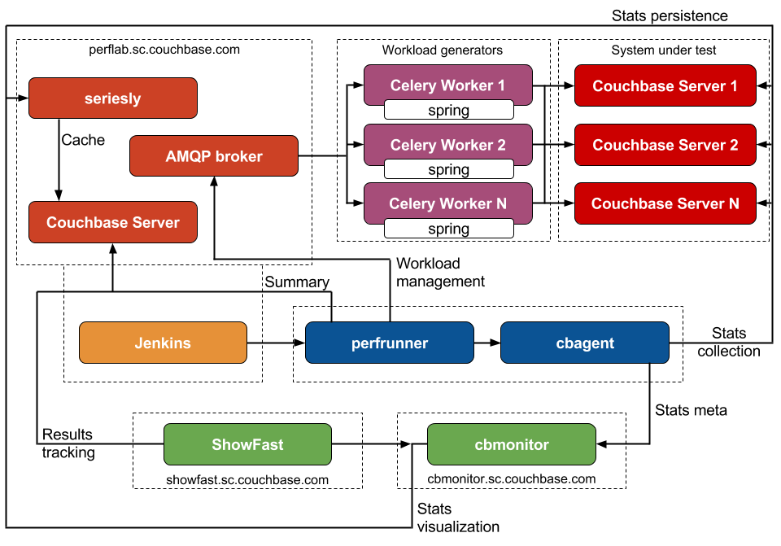

Related projects:
* [spring](https://github.com/couchbaselabs/spring)
* [cbagent](https://github.com/couchbaselabs/cbagent)
* [cbmonitor](https://github.com/couchbase/cbmonitor)
* [showfast](https://github.com/couchbaselabs/showfast)
* [seriesly](https://github.com/dustin/seriesly)
* [seriesly client](https://github.com/pavel-paulau/seriesly-python-client)
* [moveit](https://github.com/pavel-paulau/moveit)
* [dcp](https://github.com/couchbaselabs/python-dcp-client)

Requirements
------------

* Python 2.7 (e.g., python-dev package for Ubuntu or [this](https://www.digitalocean.com/community/tutorials/how-to-set-up-python-2-7-6-and-3-3-3-on-centos-6-4) for CentOS)
* virtualenv
* [libcouchbase](http://www.couchbase.com/communities/c-client-library)

Optional:
* AMQP broker (RabbitMQ is recommended) for distributed workloads

Python dependencies are listed in requirements.txt. `make` creates virtual environment (Python sandbox) and installs those packages.

SUT dependencies:
* numactl
* iostat

Installation
------------------------------

Before using perfrunner you should install the requirements listed in the requirements section. At a minimum you need Python 2.7, virtualenv, and libcouchbase.

First clone the perfrunner repo with the command below.

    git clone https://github.com/couchbaselabs/perfrunner.git

Once inside the perfrunner directory create a virtual environment for all of the perfrunner dependencies and activate the virtual environment.

    cd perfrunner
    virtualenv -p /usr/bin/python env
    source env/bin/activate

Now you need to install all of the dependencies so that you can run perfrunner.

    pip install -r requirements.txt --global-option="build_ext" --global-option="--include-dirs=/usr/local/include" --global-option="--library-dirs=/usr/local/lib"

You are now ready to use perfrunner. Once you are done running tests remember to deactivate the virtual environment by running the following command.

    deactivate

Cluster installation and setup
------------------------------

    ./env/bin/python -m perfrunner.utils.install -c ${cluster} -v ${version} -t ${toy}
    ./env/bin/python -m perfrunner.utils.cluster -c ${cluster} -t ${test_config}

For instance:

    ./env/bin/python -m perfrunner.utils.install -c clusters/vesta.spec -v 2.0.0-1976

    ./env/bin/python -m perfrunner.utils.install -c clusters/vesta.spec -v 2.1.1-PRF03 -t couchstore

    ./env/bin/python -m perfrunner.utils.cluster -c clusters/vesta.spec -t tests/comp_bucket_20M.test

Running performance tests
-------------------------

    ./env/bin/python -m perfrunner -c ${cluster} -t ${test_config}

For instance:

    ./env/bin/python -m perfrunner -c clusters/vesta.spec -t tests/comp_bucket_20M.test

Overriding test config options (comma-separated section.option.value trios):

    ./env/bin/python -m perfrunner -c clusters/vesta.spec -t tests/comp_bucket_20M.test \
        load.size.512,cluster.initial_nodes.3 4

`--verbose` flag enables Fabric logging.

`--nodebug` flag disables debug phase (e.g., execution of cbcollect_info).

With `--local` flag localhost will be used as a workload generator.

Running functional tests
------------------------

    ./env/bin/python -m perfrunner.tests.functional -c ${cluster} -t ${test_config}

For instance:

    ./env/bin/python -m perfrunner.tests.functional -c clusters/atlas.spec -t tests/functional.test

Running unit tests
------------------

After `nose` installation:

    make test

Creating "Insight" experiments
------------------------------

cbmonitor provides handy APIs for experiments when we need to track metric while varying one or more input parameters. For instance, we want to analyze how GET latency depends on number of front-end memcached threads.

First of all, we create experiment config like [this one](https://github.com/couchbaselabs/perfrunner/blob/master/experiments/get_latency_threads.json):

    {
        "name": "95th percentile GET latency (ms), variable memcached threads",
        "defaults": {
            "memcached threads": 4
        }
    }

Query for `memcached threads` variable must be defined in experiment [helper](https://github.com/couchbaselabs/perfrunner/blob/master/perfrunner/helpers/experiments.py):

    'memcached threads': 'self.tc.cluster.num_cpus'

There must be corrensponding [test config](https://github.com/couchbaselabs/perfrunner/blob/master/tests/kv_hiload_600M_ro.test) which measures GET latency.
Most importantly test case should post experimental results:

    if hasattr(self, 'experiment'):
        self.experiment.post_results(latency_get)

Finally we can execute [scripts/workload_exp.sh](https://github.com/couchbaselabs/perfrunner/blob/master/scripts/workload_exp.sh) which has `-e` flag.

Now we can check cbmonitor [UI](http://cbmonitor.sc.couchbase.com/insight/) and analyze results.
